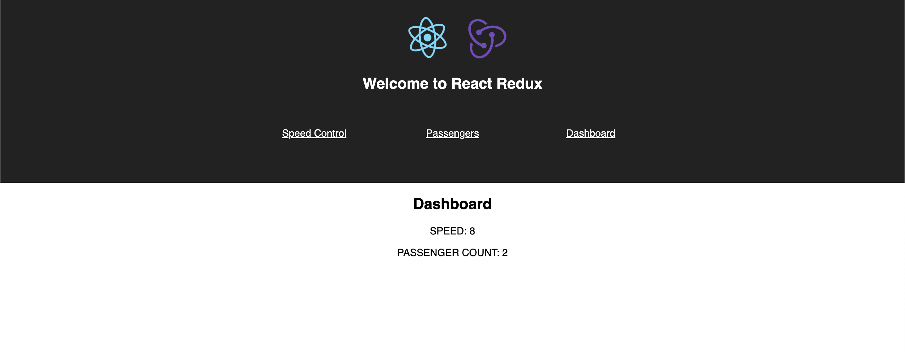

# Redux Dashboard (Spaceship)

## Description

This project has a dashboard that shows the speed of the spaceship and the total number of passengers aboard. Passengers can be added and the speed can be changes. The display for the dashboard uses redux to track the reducers for speed and passengers.

## Interface

## Languages

JavaScript, CSS, HTML, and Markdown demonstrated.

## Packages

This is built using Node.js with React and Redux utilized.

## Future Updates

Not likely going to be any as this was just an exercise.
